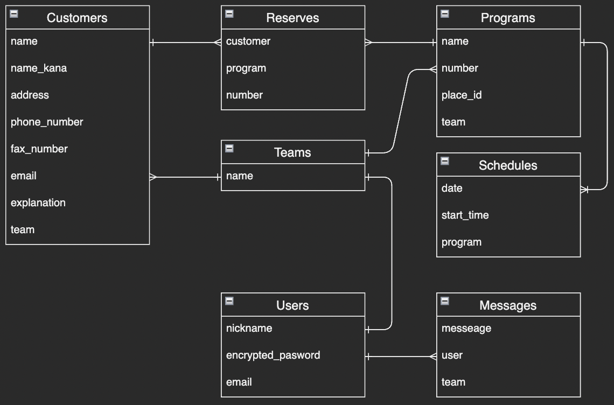

# README

## アプリケーション名
Ticket Bunch
## アプリケーション概要
演劇をはじめとする公演のチケット予約管理を行うことができる
  

## URL
https://ticket-bunch.herokuapp.com/teams/4/programs/4/schedules/new
## テスト用アカウント
ログイン用メールアドレス : test1@email  
ログイン用パスワード : password1  
Basic認証ID : katayamah  
Basic認証Pass : 12538101  
## 利用方法
#### ユーザー登録
1.トップページのヘッダーにある新規登録をクリック
2.nicknaame、メールアドレス、password、パスワード（確認用）を入力する
3.画面が遷移するので、「マイページへ移動」をクリック(マイチームが自動登録される)
4.ユーザーのマイページに遷移すると登録完了
#### 公演情報を登録する
1.マイページの左サイドメニューから「公演管理」をクリック
2.「新規公演登録」をクリック
3.「公演名」を入力し、「登録」をクリック
4.「公演日」「開始時刻」を選択し、「チケット枚数」を入力して「公演日程追加」をクリック
5.全ての公演日程を登録するまで1-5の作業を繰り返す
6.全ての公演日程の登録が完了したら「登録完了」をクリックして完了
#### 公演情報を確認する
1.マイページから公演リストの下に表示されている「公演名」の詳細ボタンをクリック
2.登録済み日時の下に「公演日」「開始時刻」「チケット枚数」が正しく表示されているか確認
#### 公演情報を編集する
1.マイページから公演リストの下に表示されている「公演名」の詳細ボタンをクリック
2.「公演名」を編集する場合は、公演名の横の編集ボタンをクリックし修正する
3.「公演日」「開始時刻」「チケット枚数」を編集する場合は、登録済み日時の横の編集ボタンをクリックし修正する
#### タスク報告
1.マイページの左サイドメニューのフォームに行ったタスクを入力する
例）公演登録を行いました、配席が完了しました　など

2.「送信」をクリック

※1つの公演情報に複数のユーザーが所属し、各ユーザーが実施したタスクを記録/閲覧できる機能を実装予定
## アプリケーションを作成した背景
学生時代に演劇活動を行っていた際、予約を紙ベースやノートアプリで管理しており、工数がかかるという課題があった。また、劇場公演の予約管理に携わる知人も同じ悩みを抱えていた。
知人は100件以上の予約を紙ベースで管理しており、複数の予約を1つの表にまとめる時に苦労していることが判明した。
そこで予約の一括管理ができるアプリケーションを開発し、知人だけでなく予約管理に困っている多くの人々に役立てたいと考えた。
## 洗い出した要件
要件を定義したシート：https://docs.google.com/spreadsheets/d/15VOcewK1n0IdZbj-5eWtZxh0SI9guDkI2WHQWpgwbt0/edit?usp=sharing
## 実装した機能についての画像やGIFおよびその説明
#### 公演管理画面
Gyazo URL : https://gyazo.com/28d6cec903d071f8d3c0230520960b6f  
・「新規公演登録」ができる  
・登録済みの公演が一覧で見ることができ、それぞれの公演の詳細ページに遷移することができる  
※ サイドメニュー(タスク報告フォームを含む)はどの画面からでも利用できる  
#### 公演詳細画面
Gyazo URL : https://gyazo.com/14cdd7d6a85f50b2a25fd34ef21a0090  
・「公演名」「日時」の編集をそれぞれ行うことができる  
・公演情報を全て削除することもできる(削除しようとするとアラートが表示される)  
#### 日時登録画面
Ggazo URL : https://gyazo.com/c8d7594918b042ebd64c3d06fd3b9e7a  
・公演の日程を追加することができる  
・公演の日程を個別に削除することができる 
## 実装予定の機能
現在、予約登録機能を実装中。  
今後は「配席機能」や「顧客登録機能」を追加するほか、複数ユーザーがチームに所属できる機能を実装予定。  
また、タスク報告機能についてはJavaScriptを使って非同期通信で投稿が確認できるように変更予定。  
## データベース設計
 
## 画面遷移図
  
## 開発環境
・HTML  
・CSS  
・Ruby  
・Ruby on Rails  
・JavaScript  
・SQL  
・GitHub  
・Visual Studio Code  
## ローカルでの動作方法
% git clone https://github.com/hachiko38101/ticket_bunch  
% cd ticket_bunch 
% bundle install  
% yarn install  
## 工夫したポイント
アプリケーションの作成前にしっかりとユーザーのペルソナや要件定義を行い、方向性を定めていたことから、作成し始めてから迷うことが少なく進めることができている。  
プログラミングスクールで習ったことだけでなく、搭載したい機能があれば積極的に調べ、搭載を試みている。  
搭載が難しいと思われる機能も、何度も方向性を変えてチャレンジすることで搭載をかなえることができた。 